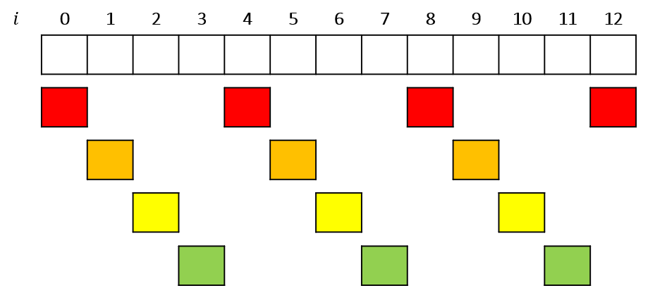

# ABC254 C - K Swap

$K = 4$ , $N = 13$ のとき，自由に swap できるグループを色分けするとこんな感じ．

When $K = 4$ and $N = 13$, we can move numbers to any position inside the group with same color. As showed in the picture below.

なので，グループごとに昇順にソートしてから，全体的に正しくソートされているかをチェックすればよし．

So, sort numbers in each group, and then check if the whole array is properly sorted.
