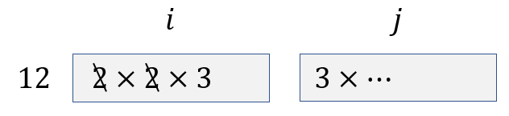

# AtCoder Beginner Contest D - Together Square

[solution](d.cpp)

「$i \times j$ は平方数である」を言い換えると，「 $i$ と $j$ を素因数分解して，合わせた各々の素因数の数はすべて偶数である」．

"$i \times j$ is a squre number" equals to "number of each $i \times j$'s prime factor is even".

$i$ を固定した状態で，あり得る $j$ の値の数を求めればいい．

Find the number of $j$, when keeping the value of $i$ unchanged.

下図のように， $i$ が $12$ のとき， $12$ の素因数である $2$ の個数は偶数個なので，考えなくていい．残りは $3$ が $1$ 個． $i \times j$ を平方数にするためには， $j$ が $3$ を奇数個持つ必要がある．そして， $3$ 以外のすべての素因数の個数が偶数であればいい．つまり， $j \div 3$ は平方数である．

When $i = 12$, prime factors are $2, 2$ and $3$. Since there are two $2$ s, we can ignore it. There is a $3$ left. In order to make $i \times j$ a squre number. There must be one $3$ and a squre number in $j$.

$j$ が $N$ 以下であるため，$3$ 以外の平方数は $N \div 3$ 以下である．なので， $N \div 3$ 以下の平方数の数は $i$ が $12$ であるときに，あり得る $j$ の値の数である．

Since $j$ is $N$ or less, the squre number besides $3$ is $N \div 3$ or less. So, we only have to find how many squre numbers there are that is equal or unber $N \div 3$ at this case.

まとめると，

- まず，すべての $i$ について， $i$ 中の偶数個ある素因数を排除し，奇数個ある素因数を $1$ 個だけ残す．得られる数字を $i'$ とおく．（エラトステネスの篩と同じ要領で $O(N\log{N})$ で求められる）
- 次に，$N \div i'$ 以下の平方数の数 $k$ を求める．（予め， $N$ 以下の平方数配列を用意して，二分探索で求められる．計算量は $O(\log{\sqrt{N}})$ である）
- 最後に，すべての $i$ について，得られた $k$ を足し合わせた結果は答えである．全体の計算量は $O(N\log{N} + N\log{\sqrt{N}})$ つまり $O(N\log{N})$ である．

To summarize,

- First, remove all the even number prime factors, and only leave one prime factors with odd number. Let's call the left number $i'$. (Do the same thing as Sieve of Eratosthenes, with a complexity of $O(N\log{N})$).
- Then, find the number of squre numbers equal or less than $N \div i'$. Let's call it $k$. (You can find $k$ in a complexity of $O(\log{\sqrt{N}})$ using binary search).
- Finnaly, add all the $k$ s. And you can get the answer. The total computational complexity is $O(N\log{N})$.
