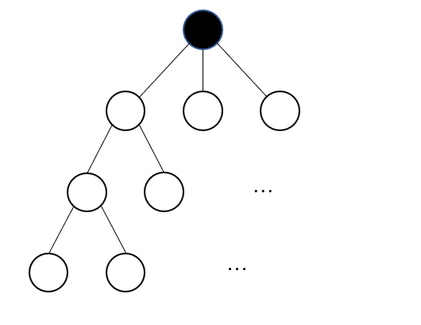

# AtCoder Beginner Contest E - Small d and k

[solution](e.cpp)

各頂点の次数は $3$ 以下である．また，クエリで聞かれる距離 $k_i$ も $3$ 以下であるため，各頂点に対し，距離が $3$ 以下の頂点個数は高々 $1+3+6+12=22$ 個である（下図）．全探索でも間に合う．

Since the degree of each vertex is at most $3$, and also, questioned distance is also at most $3$, as showed in the picture below, the maximum number of node to see for each vertex is only $1+3+6+12=22$ .

幅優先探索(BFS)の要領で，距離の近い頂点から探索すればいい．そこで注意すべきなのは，探索済みのノードを重複して加算しないこと．setで管理するとよい．

Using Breadth-First Search to find all the vertices that is near by. Notice that, do not add the value of a node several times when computing. It is good to use a set to record which nodes were added.
