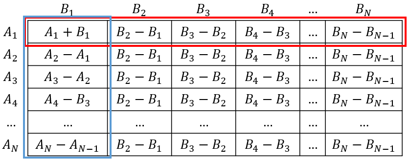

# AtCoder Beginner Contest F - Rectangle GCD

[solution](f.cpp)

数列 $A$ と数列 $B$ でできるマス目は以下のよう．

We can make a table like this using array $A$ and array $B$.

赤い枠に注目すると．

When looking at the red part.

赤い枠中の $gcd$ は，ユークリッドの互除法の原理で以下のように変換できる．

We can deformation the formula like below using Euclidean Algorithm.

$$
gcd(A_1+B_1, ..., A_1+B_{N-1}, A_1+B_N)\\
=gcd(A_1+B_1, ..., gcd(A_1+B_{N-1}, A_1+B_N))\\
=gcd(A_1+B_1, A_1+B_2, ..., gcd(A_1+B_{N-1}, (A_1+B_N)-(A_1+B_{N-1})))\\
=gcd(A_1+B_1, A_1+B_2, ..., gcd(A_1+B_{N-1}, B_N-B_{N-1}))\\
=gcd(A_1+B_1, ..., A_1+B_{N-1}, B_N-B_{N-1})\\
$$

同じように，後ろから数式を変形すると

We can get the below formula, by deformating the other parts in the same way

$$
gcd(A_1+B_1, B_2-B_1, B_3-B_2, ..., B_N-B_{N-1})
$$

になる．

これを表に埋めると

Filling the table with the formula.

これを全部の行に適応すると

Fill all the rows.

同じく，列に注目すると

Focus on the columns.

以下のように変換できる

It can be deformated like this.

つまり， $A_1～A_N \times B_1～B_N$ 範囲の最大公約数は以下の $3$ つの部分の最大公約数

So, the gcd of area $A_1～A_N \times B_1～B_N$ is made from these 3 parts.

- $A_1+B_1$
- $B_2-B_1, B_3-B_2, ..., B_N-B_{N-1}$
- $A_2-A_1, A_3-A_2, ..., A_N-A_{N-1}$

同じことは各 $query$ の範囲にも言える．範囲 $h_1～h_2 \times w_1～w_2$ の最大公約数は

We can say the same thing to the area of each query.

The greatest common divisor is composed by the below parts.

- $A_{h_1}+B_{w_1}$
- $B_{w_1+1}-B_{w_1}, B_{w_1+2}-B_{w_1+1}, ..., B_{w_2}-B_{w_2-1}$
- $A_{h_1+1}-A_{h_1}, A_{h_1+2}-A_{h_1+1}, ..., A_{h_2}-A_{h_2-1}$

以上の部分の最大公約数である．

効率的に部分の最大公約数を求めるため， $A_i-A_{i-1}$ と $B_j-B_{j-1}$ を gcd の segment tree で保管すれば $O(logN)$ で求めることができる．

To calculate the range gcd, we can put $A_i-A_{i-1}$ and $B_j-B_{j-1}$ to a gcd segment tree. The complexity is $O(logN)$ for each query.
